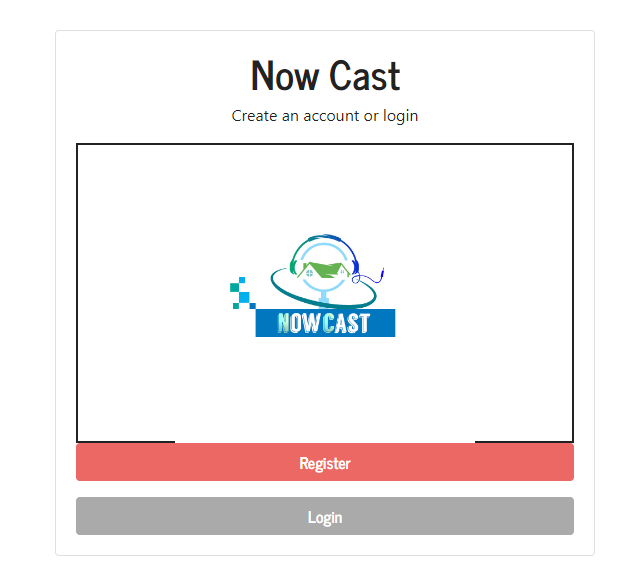

# This is NowCast web application.


## Login


## Register


### Version: 2.0.0

### Usage

```sh
$ npm install
```

```sh
# Or run in production
$ npm start
# Or run in development
$ npm run dev

# Visit http://localhost:5000
```

### MongoDB

Open "config/keys.js" and add your MongoDB URI, local or Atlas
